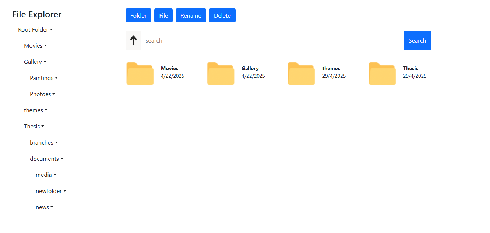

# Basic_frontend_file_explorer
# this is a basic implementation of a standard file system where you can make, rename and delete files and folders
# You can also make files and folders inside of folders you have made, making it simulate a real file system
# The method used in updating the GUI for the file system is inefficient, as it needs to constantly empty and regenerate elements in the DOM. As a result of this, it would not be able to handle large volumes of folders and files, which would be reflected
on the GUI.
# This project is for learning purposes, for many including the author to understand the file tree system and recursive
tree traversal algorithms. You may explore and experiment with it as you like. Have fun!
# the simple implementation of a file manager using pure client-side technology is all thanks to the recursive data structure 
of a file system where an object exixts inside another:
let root = {
    name:'folder-name',
    type: 'folder',
    date: 'time created',
    content: [{
        name:'folder-name',
        type: 'folder',
        date: 'time created',
        content: [{name:'folder-name',
            type: 'folder',
            date: 'time created',
            content: [{}]}]
    },{
        name:'folder-name',
        type: 'folder',
        date: 'time created',
        content: [{}]
    }]
}
# For further study, you may refer to "The Recursive Book of Recursion" by Al Sweigart.
# It features the pre-order depth-first-search algorithm, used for searching folder names and navigating to parent folders in this project
# Each folder is treated as an object, which can contain another object
# This project has been written in vanilla JavaScript and no dependencies or frameworks whatsoever, other than CSS bootstrap

*********HOW TO USE***********
To create a new folder or file, click on the "New Folder" or "New File" button. 
An input field with an add "button" will appear. Enter the name of the file or folder and hit the add button. A file icon with the name you just inputed will
be displayed. You can do this as many times as you like. When you click the folder icon, it will lead you to an empty directory.
You can inspect the webpage with your dev tools and see what is being logged in the console. If you create a file or folder inside the folder whose icon you
just clicked on, you should see it reflected in the console on the web browser.

To rename a file or folder, first click the "rename button" and then click directly, the name of the folder or file you want to rename, which
is displayed boldy, next to the file/folder icon and above the date the file/folder was created. An input field will appear. Enter the new name and hit the add
button, and you have changed it successfully.

********Picture************
Here is the image of the file explorer

